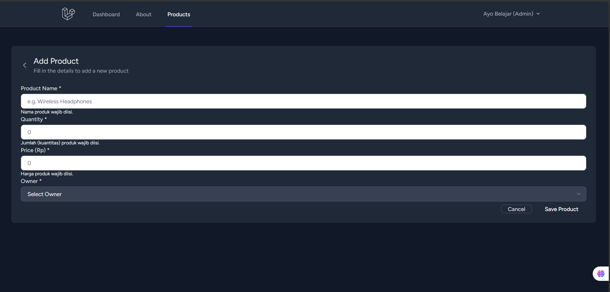
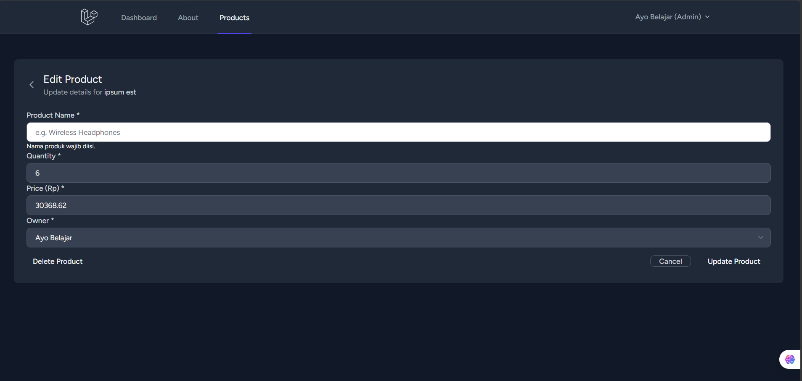
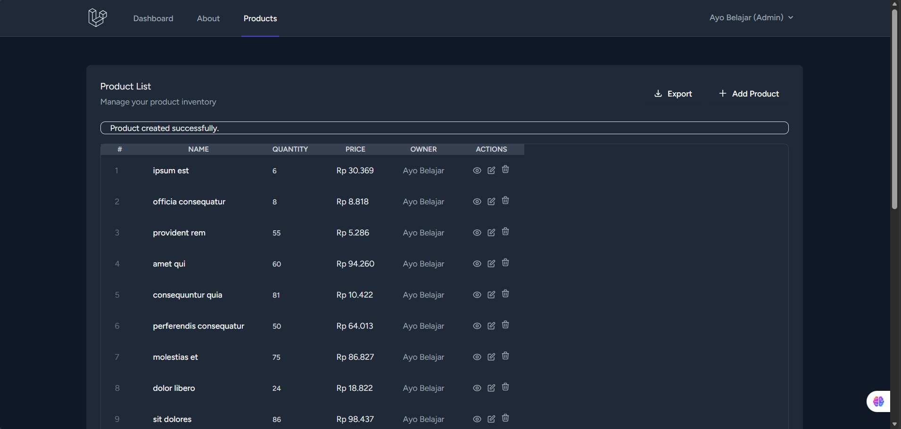

# Dokumentasi Pertemuan 6 - Laravel Validation & Authorization

Pada pertemuan 6 ini, dilakukan penguatan pada sistem validasi data saat proses **Store** (tambah data) dan **Update** (ubah data) produk. Implementasi kali ini menggunakan **Form Request** untuk memisahkan logika validasi dari Controller, serta penanganan otomatis untuk field `user_id`.

Berikut adalah detail implementasi dan hasil pengujiannya:

---

## 1. Implementasi Form Request
Logika validasi dipisahkan ke dalam file request khusus:
- `StoreProductRequest.php`: Menangani validasi saat membuat produk baru.
- `UpdateProductRequest.php`: Menangani validasi saat memperbarui produk.

Kedua request ini memastikan bahwa:
- Nama produk wajib diisi.
- Kuantitas harus berupa angka bulat.
- Harga harus berupa angka yang valid.
- `user_id` divalidasi keberadaannya di tabel users (khusus untuk admin).

---

## 2. Validasi Input Produk
Sistem akan memberikan peringatan jika pengguna memasukkan data yang tidak sesuai atau mengosongkan field yang diwajibkan.

### A. Validasi pada Form Tambah

### B. Validasi pada Form Edit

---

## 3. Notifikasi Sukses

Setelah data berhasil divalidasi dan disimpan, sistem akan menampilkan notifikasi sukses.

---

## Kesimpulan
Dengan implementasi ini, aplikasi menjadi lebih robust terhadap input yang tidak valid dan memastikan integritas data (setiap produk memiliki pemilik). Penggunaan Form Request juga membuat kode di `ProductController` menjadi lebih ringkas dan mudah dibaca.
