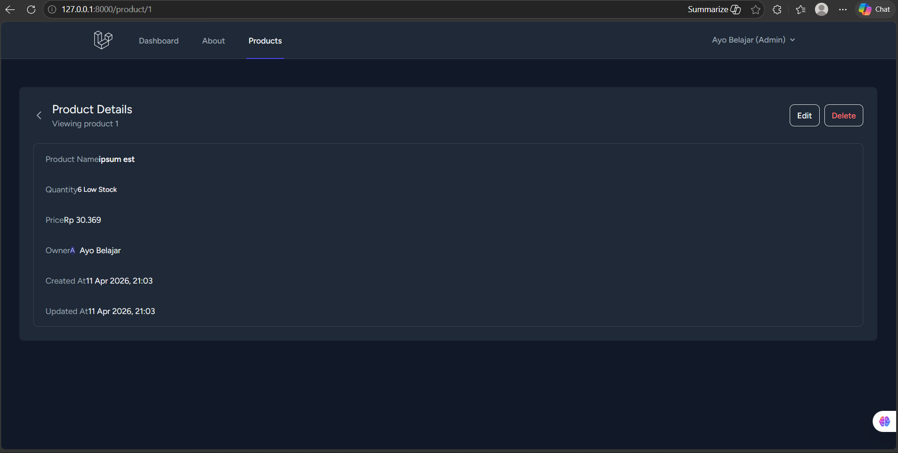

# Dokumentasi Pertemuan 7 - Laravel Components

Pada pertemuan 7 ini, fokus utama adalah implementasi **Blade Components** di Laravel. Component memungkinkan kita untuk membuat potongan UI yang dapat digunakan kembali (reusable), sehingga kode pada view menjadi lebih bersih dan modular.

## Hasil Implementasi pada View

Seluruh component tersebut telah diintegrasikan ke dalam halaman index produk (`product/index.blade.php`). Berikut adalah tampilan tombol Detail, Edit, dan Delete yang telah menggunakan component:

